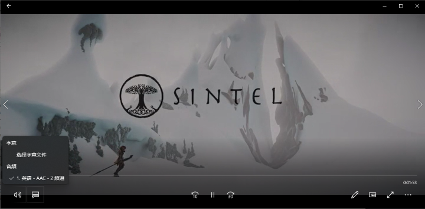
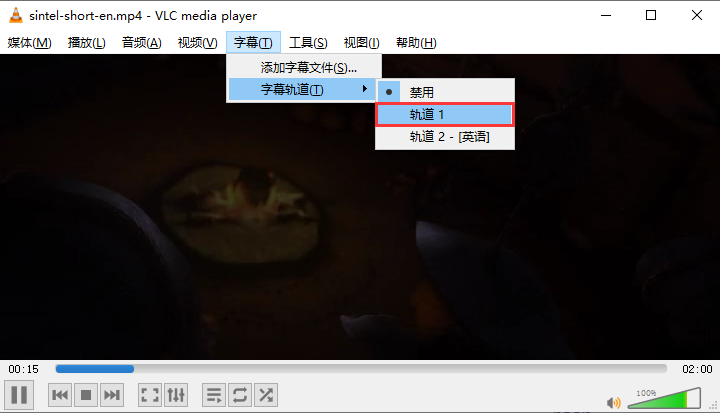
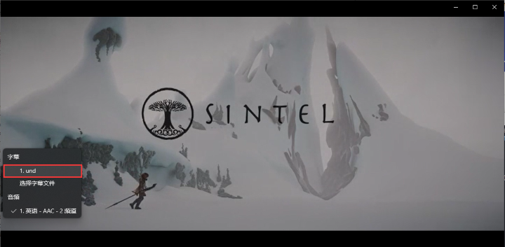
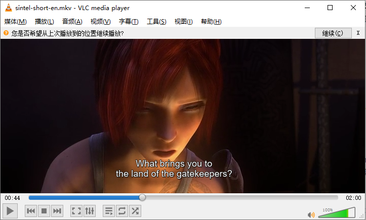
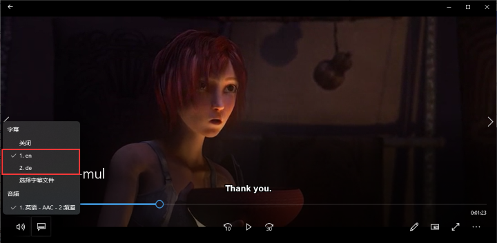
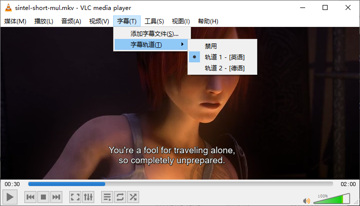
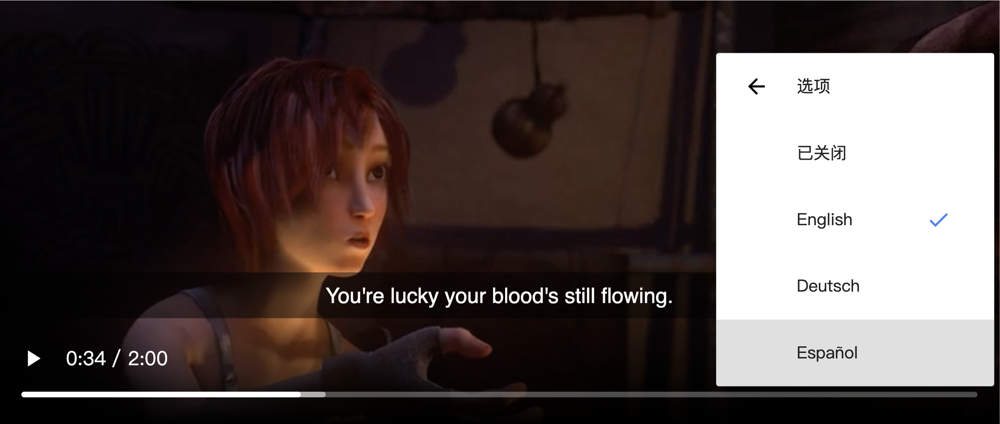
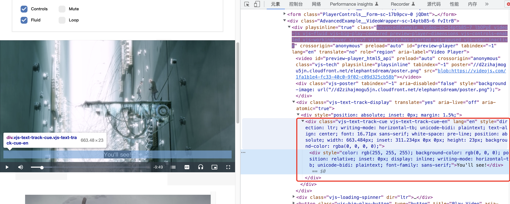

## 视频字幕

对于常见的视频（如 mp4、mkv）而言，根据字幕信息嵌入到视频中的方式，可以把字幕分为硬字幕和软字幕；

硬字幕是指字幕以图像的方式和视频画面相融合并硬编码在视频文件中，因此我们无法直接从视频中提取、编辑或删除字幕；由于硬字幕作为视频画面的一部分，因此可以保证在任何设备和任何播放器上看到的字幕都是完全一样的，不会有字体、位置等差异；想要从视频中提取出硬字幕，可以使用 OCR 从视频帧中识别字幕文本，从而生成 srt 等字幕文件。

软字幕根据字幕的加载/封装方式，可以分为内挂字幕和外挂字幕。（在部分资料中，会把内挂字幕等同于软字幕，而外挂字幕作为另一种类型）

- 内挂字幕：一般指字幕文件和视频（音频流+视频流）一同封装在（MP4、MKV）视频文件中，播放时需要经过播放器处理解析显示。字幕文件以字幕流/字幕轨的方式存在于视频文件中，一个视频可以有多个内挂字幕（即多路字幕流），用户可通过播放器切换要显示的字幕。

- 外挂字幕：指字幕以单独的文件格式存在，常见的类型有 srt、ass、vtt 等；在播放视频时，用户需要手动导入/打开字幕文件；在同一目录下，如果字幕文件名和视频文件名相同时，部分播放器能够自动加载字幕，否则需要手动打开。

软字幕的显示都需要播放器的支持，一般能够支持 mp4、mkv 和 webm；修改外挂字幕，只需要修改对应的字幕文件即可；修改内挂字幕，则需要使用相关工具对字幕流/字幕轨进行修改。


使用 ffmpeg 给 mp4 添加内挂字幕：

```bash
ffmpeg -i sintel-short.mp4 -i sintel-en.srt -c copy -c:s mov_text sintel-short-en.mp4
```


<center>Windows 默认播放器，播放时无字幕</center>



<center>VLC 播放器，播放时需要选择字幕</center>


使用 ffmpeg 给 mp4 添加内挂字幕，并转为 mkv：

```bash
ffmpeg -i sintel-short.mp4 -i sintel-en.srt -c copy -c:s copy sintel-short-en.mkv
```


<center>Windows 默认播放器，播放时需要选择字幕</center>



<center>VLC 播放器，播放时会自动显示字幕</center>


使用 ffmpeg 给 mp4 添加多个内挂字幕，并转为 mkv：

```bash
ffmpeg -i sintel-short.mp4 -i sintel-en.srt -i sintel-de.srt \
       -map 0:v -map 0:a -map 1 -map 2 \
       -c copy -c:s copy \
       -metadata:s:s:0 language=eng -metadata:s:s:1 language=deu \
       sintel-short-mul.mkv
```


<center>Windows 默认播放器，播放时可以切换字幕</center>



<center>VLC 播放器，播放时可以切换字幕</center>


> 可以看到，给 mp4 添加字幕时我们使用的是 `-c:s mov_text`，而给 mkv 添加字幕时我们使用的是 `-c:s copy`；
>
> `-c:s`是`-scodec`的简写，它用于设置字幕的编码类型；
>
> 对于 mp4 而言，我们需要指定使用 `mov_text` 编码器去处理字幕轨/字幕流。
>
> 
>
> 常见的字幕编码器（`-c:s`）参数：
>
> 对于 MKV：`copy`,`ass`,`srt`,`ssa`
>
> 对于 MP4：`copy`,`mov_text`（如果是给 MP4 添加字幕，只能用 `mov_text`）
>
> 对于 MOV：`copy`,`mov_text`


### srt 字幕文件

srt 是一种比较流行的文本字幕格式，可以使用系统自带的文本编辑器来打开。

```srt
1
00:00:00,000 --> 00:00:12,000
[Test]

2
00:00:18,700 --> 00:00:21,500
This blade has a dark past.

3
00:00:22,800 --> 00:00:26,800
It has shed much innocent blood.

4
00:00:29,000 --> 00:00:32,450
You're a fool for traveling alone,
so completely unprepared.
```


## H5 视频字幕

H5 视频字幕与普通的视频字幕相类似，也可以分为硬字幕和软字幕；硬字幕依然是已经将字幕内容编码在视频画面中，使得我们在不同的浏览器、不同的设备（移动端、PC端）能看到一样的效果。

H5 并不会从 mp4 视频中解析并显示内挂字幕，但它支持通过使用 `<track>` 元素为视频指定外挂字幕；外挂字幕的文件格式为 WebVTT，其文件名后缀一般为 `.vtt`，其 MIME 类型为 `text/vtt`；在Chrome和Firefox浏览器下，`.vtt`字幕是可以无障碍加载显示的，但是对于IE10+浏览器，虽然也支持`.vtt`字幕，但是需要定义MIME type，否则会无视WebVTT格式。

为 `<video>` 添加多个字幕：

```html
<video id="video" preload="metadata">
  <source src="video/sintel-short.mp4" type="video/mp4" />
  <!-- 英语（因为设置了 default 属性，所以会默认启用英语字幕） -->
  <track
    label="English"
    kind="subtitles"
    srclang="en"
    src="subtitles/vtt/sintel-en.vtt"
    default=""
  />
  <!-- 德语 -->
  <track
    label="Deutsch"
    kind="subtitles"
    srclang="de"
    src="subtitles/vtt/sintel-de.vtt"
  />
  <!-- 西班牙语 -->
  <track
    label="Español"
    kind="subtitles"
    srclang="es"
    src="subtitles/vtt/sintel-es.vtt"
  />
</video>
```




加载的 `.vtt` 字幕内容为：

```vtt
WEBVTT

0
00:00:00.000 --> 00:00:12.000
<v Test>[Test]</v>

NOTE This is a comment and must be preceded by a blank line

1
00:00:18.700 --> 00:00:21.500
This blade has a dark past.

2
00:00:22.800 --> 00:00:26.800
It has shed much innocent blood.

3
00:00:29.000 --> 00:00:32.450
You're a fool for traveling alone,
so completely unprepared.

4
00:00:32.750 --> 00:00:35.800
You're lucky your blood's still flowing.
```

可以看到，vtt 字幕的文本格式和 srt 字幕相似；其中，WebVTT 字幕须以 **WebVTT** 开头，以表明这是 WebVTT 字幕。

> 使用 `ffmpeg -i input.srt output.vtt` 可以将 srt 文件转为 vtt 文件

此外，在CSS中提供了专门的伪元素`::cue`来控制字幕的样式，可以控制的 CSS 属性包括：

- color
- opacity
- visibility
- text-decoration
- text-shadow
- background 及相关属性
- outline 及相关属性
- font 及相关属性，包括 line-height
- white-space

因此，我们可以通过修改`::cue`伪元素样式，来控制 H5 `<video>` 字幕样式；

我们也可以看到，原生的字幕样式控制，由于CSS属性上的限制，我们不能修改字幕出现的位置、实现更复杂的排版等，我们是否可以对字幕有更全面的样式控制？

在 video.js 中，提供了 `TextTrackDisplay` 组件来显示字幕；它将字幕内容渲染在 div 中，并以绝对定位的方式覆盖到视频上，使得我们可以修改所有的 CSS 属性。

**缺点**：部分移动端浏览器（如 iOS 浏览器、部分华为系统浏览器），全屏后会被系统劫持播放器样式，导致自定义播放器组件不显示，从而引起字幕不显示的问题。


